旅遊手札 | 2024 年遨遊西部山海騎行 (二)
===

##### 關鍵字：環島、機車環島、台灣旅遊、遊記

距離這趟旅程已經將近一年了，自去年 12 月出了第一篇遊記後，就遲遲沒有下文，為了彰顯自己的責任感，終於回來把它完成啦 😎

經歷了前兩天的雨戰，終究盼到雨過天晴。至此，行程也走過了三分之一，接下來的行程，我將穿梭於恆春半島的山海之間，用我和阿布的足跡，刻劃出專屬於南國風情的旅圖。

> 延伸閱讀：[旅遊手札 | 2024 年遨遊西部山海騎行 (一)](/posts/travel-west-coast-1/)

## Day 3 (8/11) − 逐海而南

前一晚住的長興旅社並沒有提供早餐，因此退房前有先查了一下附近的早餐選項。原先已決定去吃一家牛肉湯，不過剛跨上阿布沒多久，一條色彩鮮明的紅布條吸走了我的目光。

")

老實說我不太愛鍋燒意麵，不過都把這布條掛出來了，就想說來會一會它 😎。當天的生意不差，不過也沒有等到太久，我的餐點就全數上齊了。我點了一碗老闆味自慢的鍋燒意麵、薯餅蛋餅和紅茶 (早上一定要吃點早餐店常見的食物，沒辦法😅)。

先說一下早餐的部分，薯餅蛋餅的餅皮偏軟，我不是很喜歡；至於紅茶就是常見的早餐店紅茶，沒什麼特色。至於鍋燒意麵，我是覺得好像跟我之前吃過的鍋燒意麵沒有太大差別，不過也可能是我不愛鍋燒意麵，無法客觀評斷。

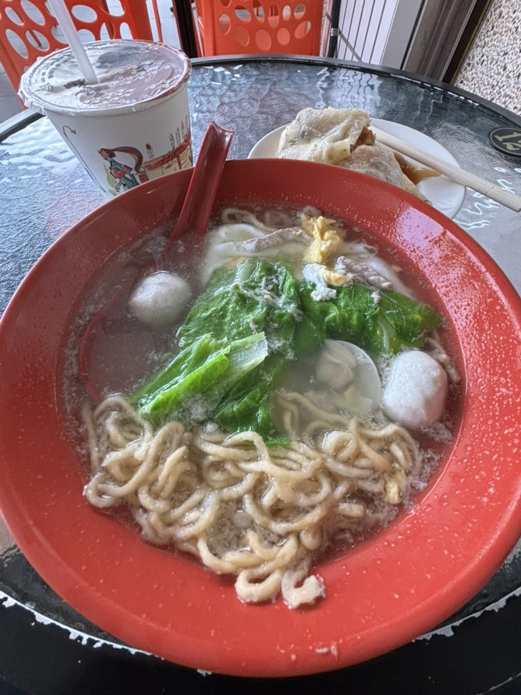

用完早餐後便踏上旅途，準備逐海而南了。這天的終點是恆春，僅需經過台南、高雄、屏東三個縣市級的行政區，體感上覺得相對輕鬆。從玉井沿著台 3 線騎乘，接著轉往台 20 線，走一小段南橫公路，經南化進入甲仙，踏入高雄市的範圍。

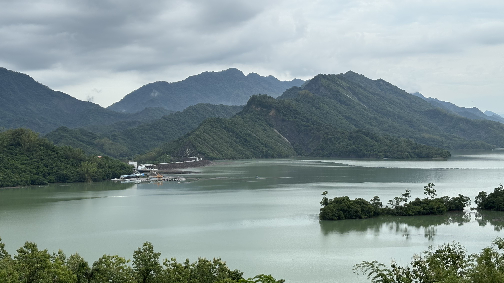
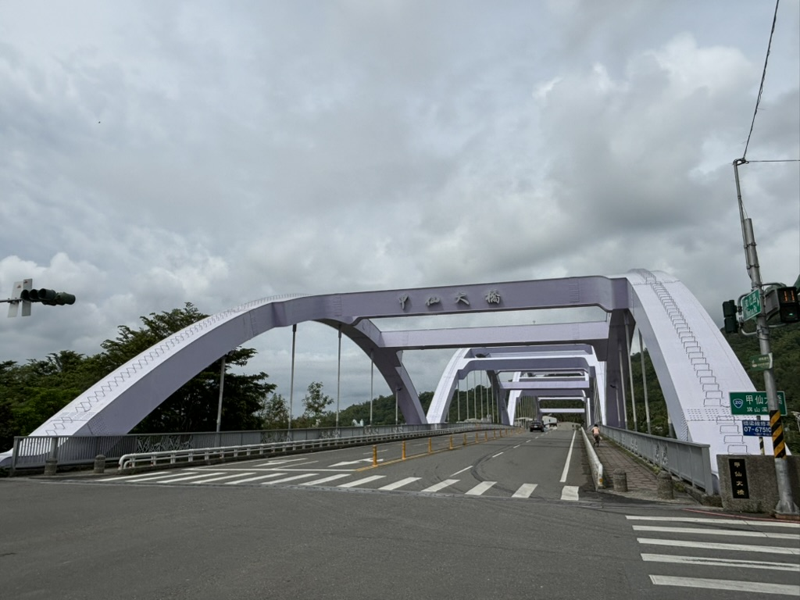

都來到了甲仙，怎麼可以不吃個芋頭冰咧 😄。當天稍微查了一下 Google 評論，決定去阿奇芋冰老店嚐一下甲仙遠近馳名的芋頭冰。我覺得芋頭的香味還算濃，整體而言不差，但沒有令人驚艷的感覺。和我心中的第一名 — 蘭嶼的雯雯芋頭冰還有一段落差。

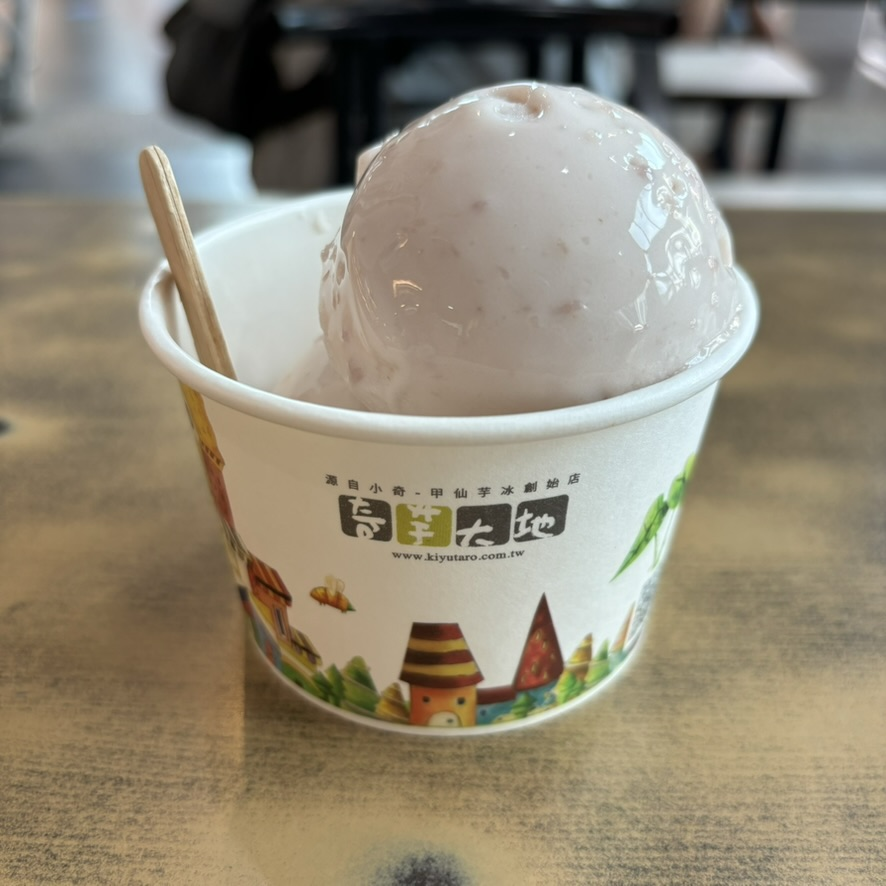

在甲仙稍作休息後便繼續啟程，接下來的路線會沿著台 29 線一路南下，到了杉林後左轉進入 181 縣道，穿過月光山隧道後抵達美濃，再繼續沿著 181 縣道騎行，經高美大橋跨越高屏溪上游，抵達屏東縣高樹鄉。

可能是前兩天都穿梭於山林之間，加上當天湛藍如畫的天色，都驅使著我內心想要看見大海的衝動，一路上並沒有做過多的休息，到了高樹後便順利接上鼎鼎大名的沿山公路 — 185 縣道。185 縣道的道路筆直，且路廊沿著淺山闢建，即便是酷暑的 8 月中，仍能感受到一絲涼爽暢快，而我也乘著這股愜意，很快地走到 185 縣道的終點，水底寮。

8 月的酷暑實在難耐，尤其又是在這個日正當頭之時，轉往台 1 線南下後不久，便決定在 7–11 海豚灣門市簡單補給一下。海豚灣 7–11 不僅是一個著名地標，對我而言，它的存在更像是種旅途的儀式感，即便不太疲憊，但經過時總會想要稍作停留，為接下來的南國風情展開序幕。我在海豚灣 7–11 的店內座位區啜飲著沁涼的美式咖啡，望向這幾天來引頸期盼的大海 — 我和阿布，也默默地，將抵達國境之南了。

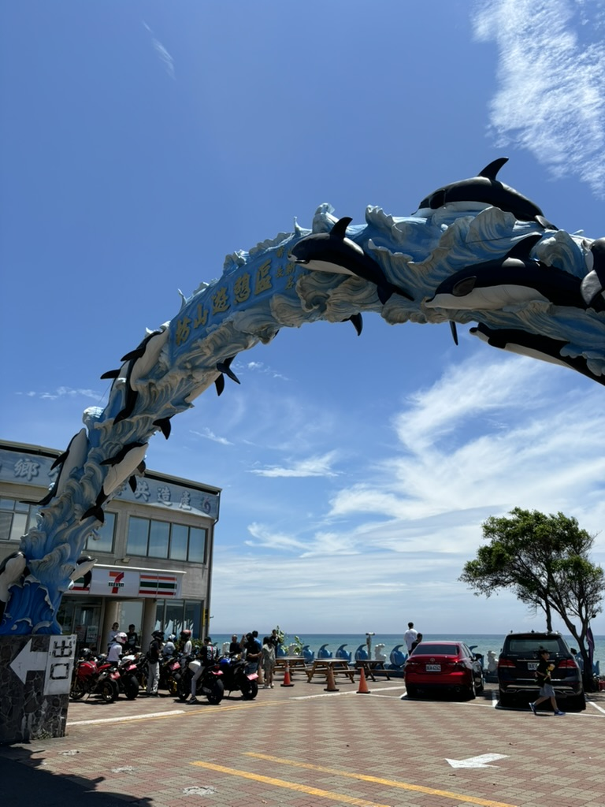

我在下午 2 點左右抵達今晚下榻的民宿 — AND 宅，我住的是 2 館，位在恆春南門圓環附近，機能相當便利。入住當天是星期日，房價為 1200，我認為是很親民的價格。另外，2 館的樓下是一家冰品店，入住的房客可以免費領取一支冰淇淋！

在房間稍作休息後，我便繼續跨上阿布，繼續探索恆春半島。第一站決定去後壁湖吃個生魚片，事前並沒有做太多功課，只有在出發前稍微看一下 Google 評論，後來決定來吃這家阿興生魚片。

不得不說，在阿興生魚片吃的這餐並沒有非常開心。點餐規則是這樣的，不能只點生魚片，至少要點一盤熱炒類，這點我完全可以接受，但是我想吃的雨來菇炒蛋並不算熱炒類，是因為太便宜了嗎 🙂。總之，我後來就點了一盤蔥爆牛肉。

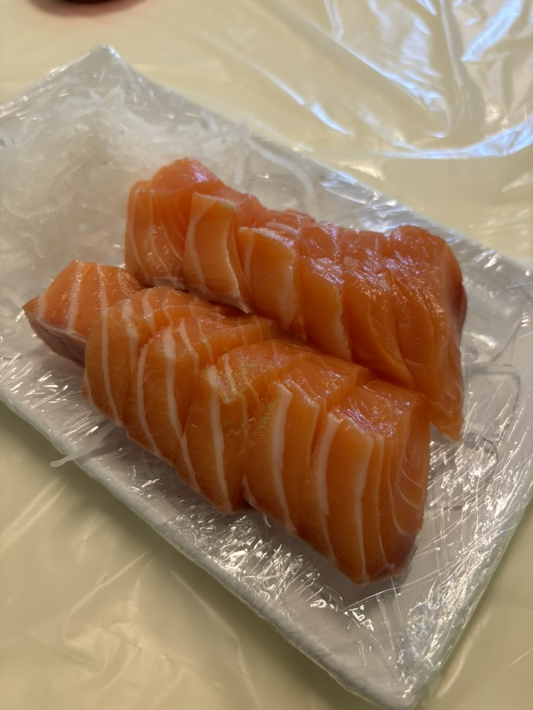
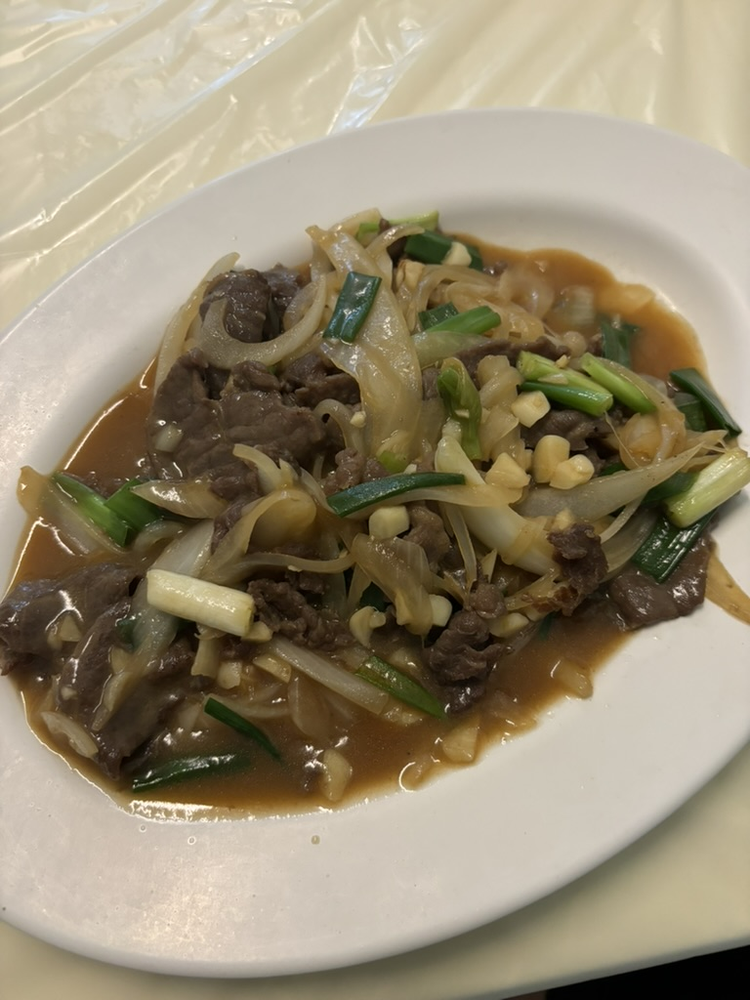

不過出遊的心情並未受到太多影響，吃飽喝足後便動身前往南灣沙灘踏踏浪泡泡水，順道欣賞美麗的 Bikini 風景 🤫。約莫黃昏時分，我就回到恆春市區，準備享用我期待已久晚餐 — 和平披薩。

第一次與和平披薩的邂逅是在 2021 年，當時是和女友小旅行時，女友做功課找到的寶藏店。由於從備料、餐點製作、甚至是店內清潔和收銀，這些餐廳營運事務通通由老闆一人包辦，所以餐廳採預約制，且即便入座後也需要耐心等候一陣子才能享用到美味的餐點。但我必須說，這些等待真的值得。

和平披薩的菜單是不定期更新的，這次我選擇特製紅醬白蝦義大利麵作為主餐，收汁可以說是恰到好處，且麵體都吸附著白蝦的香氣，真的太頂，只能說我沒了。另外補充一下個人感想，雖然店名是和平披薩，但我更喜歡他們家的義大利麵。

拉回來談一下這趟旅程的主軸吧！這趟因轉職而起的旅途，在前面幾天都是用沒休完的特休出來玩的，不過在 2024 年的 8/11 當天，是我理論上的最後在職日，事實上在吃晚餐的當下，早已過了下班時間，其實我已經屬於失業人口了😆。我也在這天晚上開了一瓶啤酒，慶祝這美好的夜晚 (?)

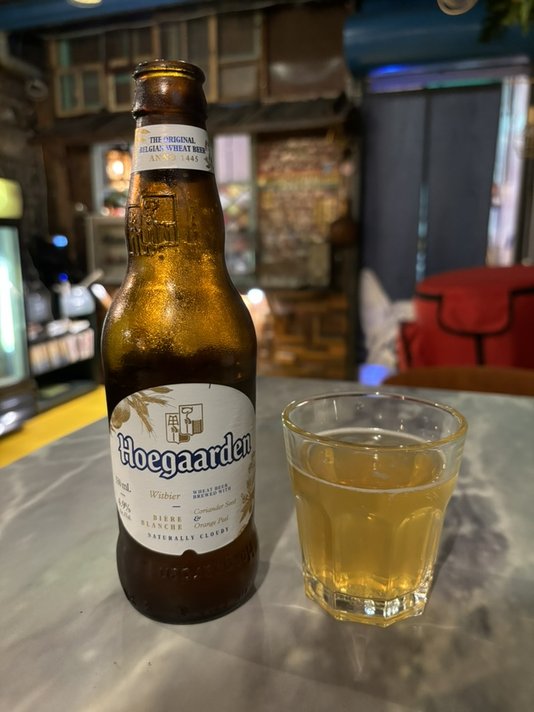

## Day 4 (8/12) − 半島漫遊

成為無業遊民的第一個「上班日」，不再有短促的列車警示鈴，也沒有節奏分明的人潮腳步聲，取而代之的，是恆春半島的恬靜與悠閒。今天的行程主軸會放在恆春半島，會沿著台 26 線、縣道 200、200 甲、199 甲、199 這幾條公路後，最後在壽峠接上台 9 線往西，到楓港接回台 1 線，環繞整個恆春半島。

這天大約 9 點左右退房，到附近的西式早午餐店簡單吃個早餐後，便展開了今天的半島漫遊。第一站便忽悠悠地晃到臺灣最南點 — 鵝鑾鼻。

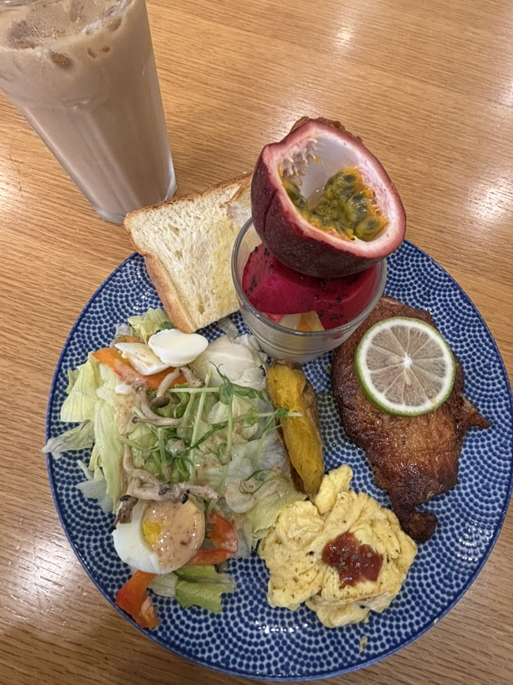
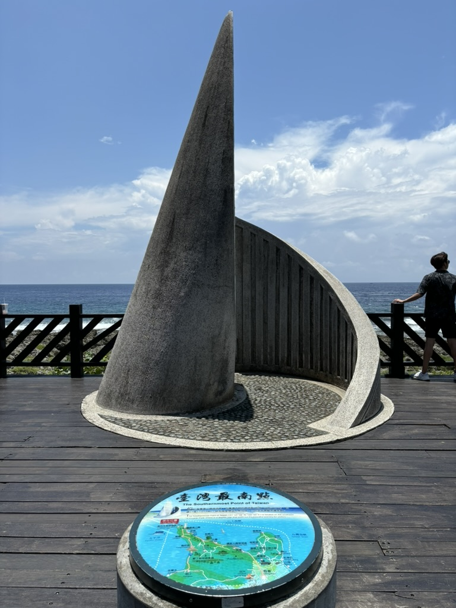

這並不是我第一次來到鵝鑾鼻，不過路過總會想要有個踩點的儀式感。由於酷暑難耐，在最南點紀念碑並沒有多做停留，就繼續啟程了。從這裡開始，旅途方向開始北轉，意味著美好的光陰逐漸流逝，一步步向現實靠攏。

北轉後第一個遇到的景點是龍磐草原。初見龍磐草原時，其風光明媚令我十分難忘，旅行當天的景色更勝過往，如茵的草原為基底，再以乳白色的木欄杆作為點綴，構築這幅心曠神怡的風景畫。

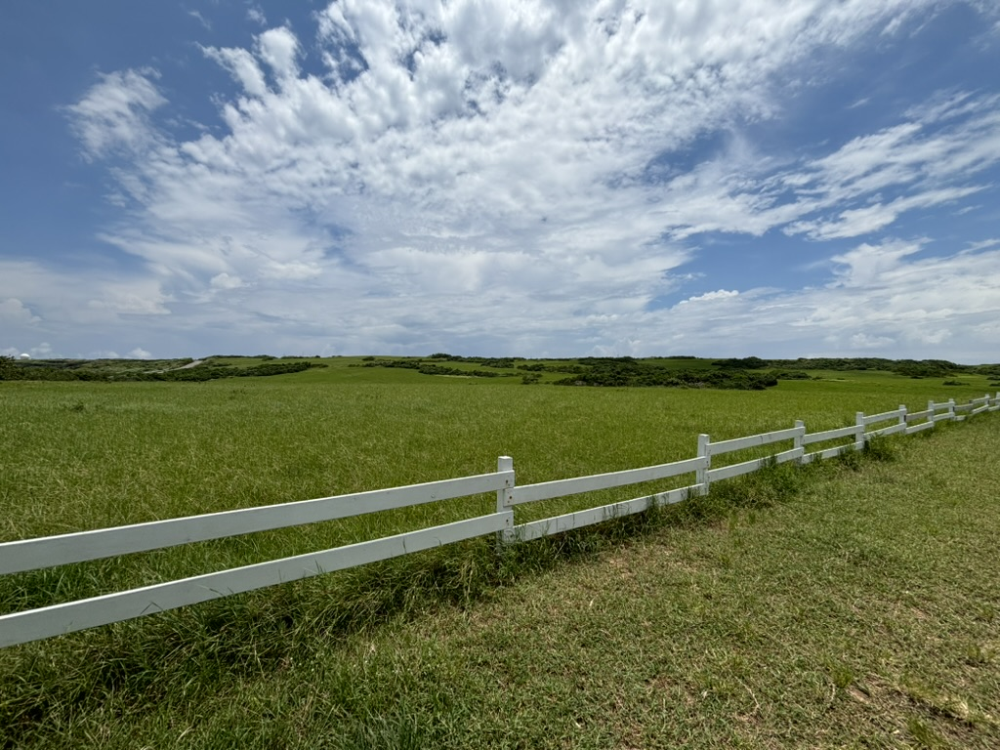
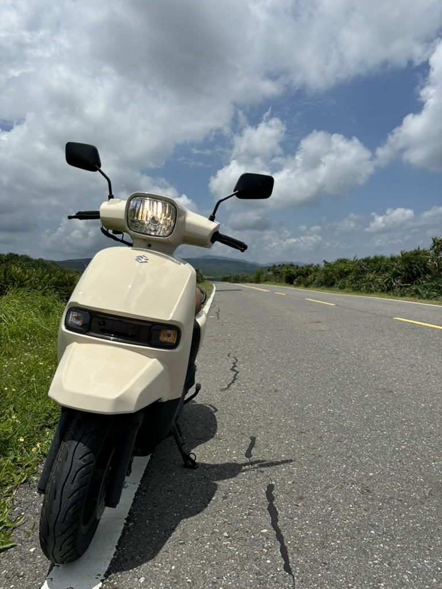

後來到滿洲的全家小歇一會，順便查看了一下接下來的路線。原先計劃是直接前往旭海，但後來發現時間上仍舊相當充裕，於是決定中途再安插一個行程。沿著縣道 200，看到「往高士」的指示牌後向左轉進岔路，一路隨著 Google Maps 的導航，抵達牡丹高士神社。

根據[維基百科](https://zh.wikipedia.org/zh-tw/%E9%AB%98%E5%A3%AB%E7%A5%9E%E7%A4%BE)記載，高士神社祭祀高士部落的戰士，包含牡丹社事件為部落犧牲的族人、二戰期間受日本政府徵兵的排灣族軍人等，是臺灣戰後唯一一座供奉祖靈的神社。

<!-- TODO: add image — 1:47 PM，牡丹高士神社 -->

在這邊不多做停留便下山，繼續往旭海前進。雖然我不是森林系的，不過在下山的路上，發現整體的林相跟蘭嶼有點類似，論緯度的話滿洲/牡丹一帶和蘭嶼大致相同，不確定我的觀察是否正確 😅

再往北騎沒多久，就到了今天的重頭戲 — 旭海。大約 5–6 年前就慕名旭海美景，曾在 5 年前和一群友人來過一次，當時應該還算是鮮為人知的景點 (?)

近年來或許是短影音的推波助瀾，旭海不再保有那份遺世獨立的寧靜，雖稱不上人聲鼎沸，卻也讓人忍不住懷念起當年那片無人打擾的寧靜。旅途當天是星期一，仍舊有 3–4 組遊客在旭海彎排隊拍照。

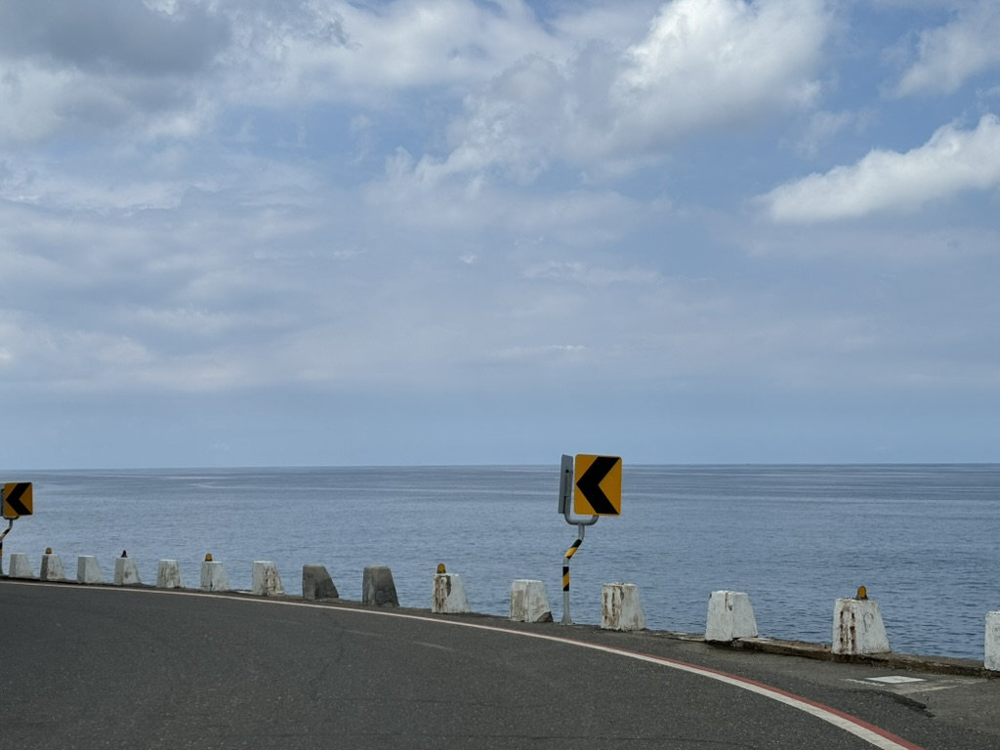

匆匆拍完照後，我便到一旁的海灘踏踏浪、泡泡水，遠離人群的同時，也試圖找回旭海熟悉的那份寧靜。時間倏忽即逝，又呆上了半個鐘頭後，才又跨上阿布繼續北返。今晚的住宿點在高雄市區，路途並不遙遠，但連日的騎行也開始讓體力逐漸消磨。

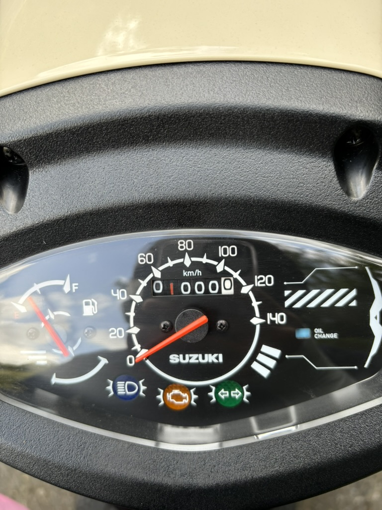

抵達高雄市區時已夜幕低垂，我抓緊時間到機車行幫阿布換好機油，大約 8 點左右完成旅館 Check-in，並將一切安頓好之後，到外頭去找晚餐吃。對吃飯比較沒想法的我，後來決定走去七賢二路吃丹丹，心想 15 分鐘的路程並不遠，但我又双叒叕再次低估了臺灣的濕熱，於是回程就搭捷運了 😆

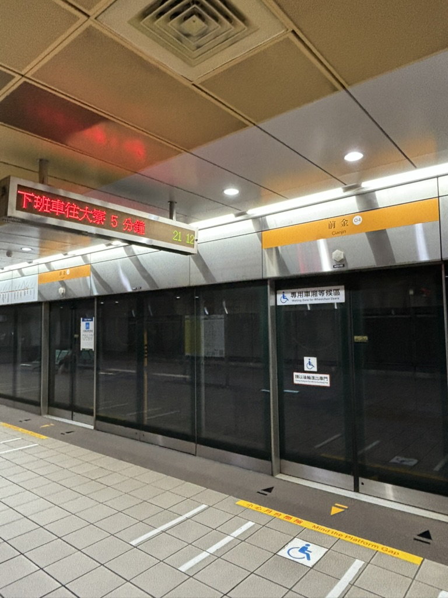

回到旅館後先去洗個澡，就回到床上耍廢了。在床上回想著旅途這幾天下來的種種，只能說身心靈感到無比的滿足！雖然旅程的前兩天，總有午後雷陣雨攪局，所幸在半島漫遊的兩天，老天賞臉給了我兩天的好天氣，讓我玩得相當盡興！

接下來要繼續北返，逐步回歸社畜人生，究竟下一篇什麼時候會生出來呢，就讓我們拭目以待吧 🙂
